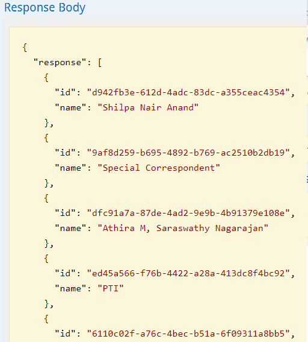
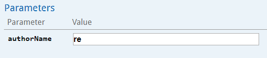
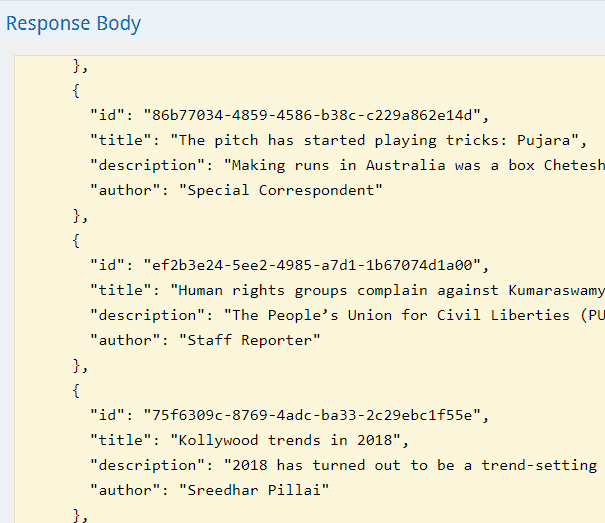
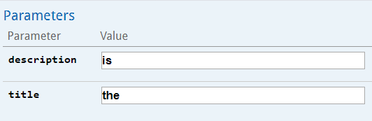
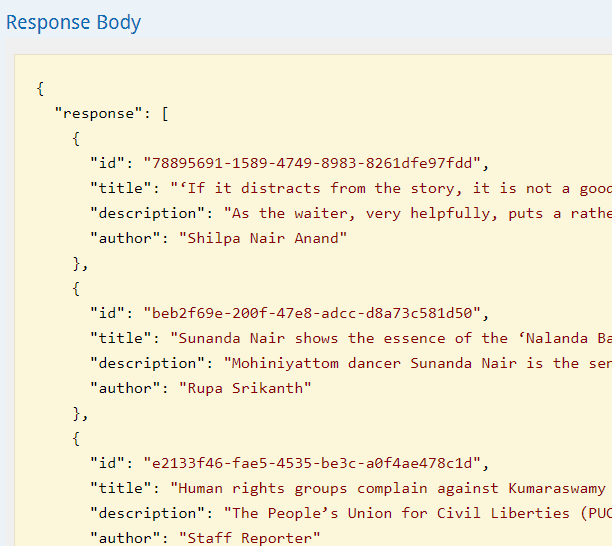

# News Scraper Service
Web service to scrap news articles and query scrap data using REST endpoints 

It scraps the configured url for news article and stores then in database. Then this data can be searched using REST api.

Tech stack: **Java, Spring Boot, Spring Data Jpa, HtmlUnit, Swagger**. Database used is **h2** db.

## Configuration
The scraping url and db properties are configurable through application.properties in `src/main/resources`.

## How to run

`Note: Once application starts, scraping will continue in background thread. Swagger can still be used to interact with api during this time.`

Application swagger can be found at http://localhost:8080/swagger-ui.html#/News_Scrapper

1. Run using maven plugin

To run by maven plugin, run below command:
```
mvn spring-boot:run
```

2. Run using executable jar

To create excutable jar, run below command:
```
mvn clean package
```
Then run the application by going tp target folder and running:
```
java -jar news-scraper-service-1.0.0-SNAPSHOT.jar
```

## H2 DB web interface

Go to http://localhost:8080/h2-console

JDBC URL will be `jdbc:h2:mem:news_scraper_db`

## Use cases

1. Search available authors

**Request**

```
http://localhost:8080/v1.0/authors
```

**Output**



2. Search article based on author name

**Request**

```
http://localhost:8080/v1.0/articles?authorName=re
```



**Output**



3. Search article based on text and description

**Request**

```
http://localhost:8080/v1.0/articles?description=is&title=the
```



**Output**



